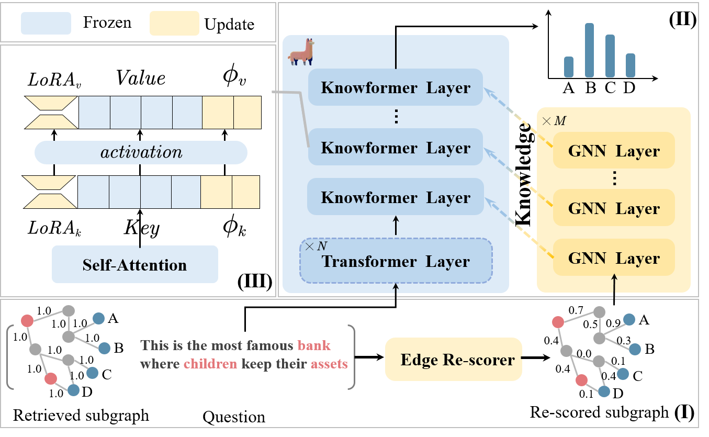

# Question-guided Knowledge Graph Re-scoring and Injection for Knowledge Graph Question Answering
The official repository of the EMNLP 2024 Findings paper :[Question-guided Knowledge Graph Re-scoring and Injection for Knowledge Graph Question Answering](https://arxiv.org/abs/2410.01401)

## Update 📌
- [2024/9/20] Q-KGR is accepted to findings of EMNLP2024!
- [2024/10/2] We release the paper of our Q-KGR on Arxiv.
- [2024/11/2] We released the training and inference codes and datasets.

## What is Q-KGR 👀
This paper proposes modeling and denoising retrieved knowledge from KG using GNNs and injecting it into the parameter space of LLMs for KGQA.


## Install 🛠️

1. Clone this repository and navigate to Q-KGR folder

```bash
git clone https://github.com/EchoDreamer/Q-KGR.git
cd Q-KGR
```

2. Install packages

```bash
conda create -n graphllm python=3.8
conda activate graphllm
conda install pytorch==2.0.1 torchvision==0.15.2 torchaudio==2.0.2 pytorch-cuda=11.8 -c pytorch -c nvidia
# Download transformers-4.33.3 from https://huggingface.co/271754echo/Q-KGR/ to ./
cd transformers-4.33.3
pip install -e . 
bash setup.sh
```

## Experiment 🚀

### 1. Download data

### Download and preprocess data yourself

**Preprocessing the data yourself may take long, so if you want to directly download preprocessed data, please jump to the next subsection.**

#### Step 1: Download raw data and  carry out the initial preprocessing of the data.

The code is based on [NAACL 2021\] QAGNN: Question Answering using Language Models and Knowledge Graphs 🤖](https://github.com/michiyasunaga/qagnn) or [NeurIPS 2022\] DRAGON 🐲: Deep Bidirectional Language-Knowledge Graph Pretraining](https://github.com/michiyasunaga/dragon).

The resulting file structure should look like this:

```bash
.
├── README.md
├── data/
    ├── cpnet/                 (prerocessed ConceptNet)
    ├── obqa/
        ├── statement/         (converted statements)
        ├── grounded/          (grounded entities-there is an answer node in a subgraph)
        ├── graph/             (extracted subgraphs-there is an answer node in a subgraph)
        ├── ...
    ├── piqa/
    ├── riddle/
    └── arc/
```

#### Step 2: process the data for LLM

Previous methods, such as QAGNN and Dragon, regard the language model as a binary classification model. For each question, they extract a subgraph using all question nodes and **an** answer node, resulting in multi subgraphs (the number of candidate answers). For example:

```
{"id": "8-376", "question": {"stem": "Frilled sharks and angler fish live far beneath the surface of the ocean, which is why they are known as", "choices": [{"text": "Deep sea animals", "label": "A"}, {"text": "fish", "label": "B"}, {"text": "Long Sea Fish", "label": "C"}, {"text": "Far Sea Animals", "label": "D"}]}, "answerKey": "A", "statements": [{"label": true, "statement": "Frilled sharks and angler fish live far beneath the surface of the ocean, which is why they are known as Deep sea animals"}, {"label": false, "statement": "Frilled sharks and angler fish live far beneath the surface of the ocean, which is why they are known as fish"}, {"label": false, "statement": "Frilled sharks and angler fish live far beneath the surface of the ocean, which is why they are known as Long Sea Fish"}, {"label": false, "statement": "Frilled sharks and angler fish live far beneath the surface of the ocean, which is why they are known as Far Sea Animals"}]} 
```

Separately extract four subgraphs using the following node grounded results:

```
{"sent": "Frilled sharks and angler fish live far beneath the surface of the ocean, which is why they are known as Deep sea animals", "ans": "Deep sea animals", "qc": ["angler", "angler_fish", "beneath", "far", "fish", "fish_live", "frilled", "frilled_shark", "know", "known", "live", "ocean", "shark", "sharks", "surface"], "ac": ["animal", "animals", "deep", "deep_sea", "sea", "sea_animal", "sea_animals"]}

{"sent": "Frilled sharks and angler fish live far beneath the surface of the ocean, which is why they are known as fish", "ans": "fish", "qc": ["angler", "angler_fish", "beneath", "far", "fish_live", "frilled", "frilled_shark", "know", "known", "live", "ocean", "shark", "sharks", "surface"], "ac": ["fish"]}

{"sent": "Frilled sharks and angler fish live far beneath the surface of the ocean, which is why they are known as Long Sea Fish", "ans": "Long Sea Fish", "qc": ["angler", "angler_fish", "beneath", "far", "fish_live", "frilled", "frilled_shark", "know", "known", "live", "ocean", "shark", "sharks", "surface"], "ac": ["fish", "long", "sea"]}

{"sent": "Frilled sharks and angler fish live far beneath the surface of the ocean, which is why they are known as Far Sea Animals", "ans": "Far Sea Animals", "qc": ["angler", "angler_fish", "beneath", "fish", "fish_live", "frilled", "frilled_shark", "know", "known", "live", "ocean", "shark", "sharks", "surface"], "ac": ["animal", "animals", "far", "sea", "sea_animal", "sea_animals"]}
```

However, this approach is not suitable for generative LLMs. For example, for the question above, a prompt design for an LLM might look like the following:

```
prompt = """Frilled sharks and angler fish live far beneath the surface of the ocean, which is why they are known as

OPTIONS:
- Deep sea animals
- fish
- Long Sea Fish
- Far Sea Animals
Answer: """
```

Therefore, we use **all answer nodes** and **question nodes** to extract a single subgraph (re-grounded) as the knowledge source for the LLM:

```
{"sent": "Frilled sharks and angler fish live far beneath the surface of the ocean, which is why they are known as Deep sea animals", "qc": ["angler", "angler_fish", "beneath", "far", "fish", "fish_live", "frilled", "frilled_shark", "know", "known", "live", "ocean", "shark", "sharks", "surface"], "ac": ["animal", "animals", "deep", "deep_sea", "sea", "sea_animal", "sea_animals", "fish", "fish", "long", "sea", "animal", "animals", "far", "sea", "sea_animal", "sea_animals"], "ans": ["Deep sea animals", "fish", "Long Sea Fish", "Far Sea Animals"]}
```

re_grounded processing script: 

```
python ./process_grounded.py
```

Based on this, the script for extracting the subgraph is as follows:

```
python ./preprocess.py
```

### Resulting file structure

The resulting file structure should look like this:

```bash
.
├── README.md
├── data/
    ├── cpnet/                 (prerocessed ConceptNet)
    ├── obqa/
        ├── statement/         (converted statements)
        ├── grounded/          (grounded entities-there is an answer node in a subgraph)
        ├── re_grounded/       (grounded entities-there are all answer nodes in a subgraph for our method)
        ├── graph/             (extracted subgraphs-there is an answer node in a subgraph)
        ├── re_graph/          (extracted subgraphs-there are all answer nodes in a subgraph for our method)
        ├── ...
    ├── piqa/
    ├── riddle/
    └── arc/
```

### Directly download preprocessed data

**TL;DR (Skip above steps and just get preprocessed data)**. The preprocessing may take long. For your convenience, you can download all the processed data from huggingface (https://huggingface.co/271754echo/Q-KGR).

### 2. Training

Download Flan-t5-xl and Flan-t5-xxl in ./huggingface.

To train Q-KGR on OBQA using Lora, run

```bash
bash script/obqa_t5_lora.sh
bash script/obqa_t5_lora_xxl.sh
```

To train Q-KGR on Riddle using Lora, run

```bash
bash script/riddle_t5_lora.sh
bash script/riddle_t5_lora_xxl.sh
```

To train Q-KGR on Arc-challenge, run

```bash
bash script/arc_t5_lora.sh
bash script/arc_t5_lora_xxl.sh
```

To train Q-KGR on PIQA, run

```bash
bash script/piqa_t5_lora.sh
bash script/piqa_t5_lora_xxl.sh
```

### 3. Evaluating 

Download the trained checkpoint from huggingface (https://huggingface.co/271754echo/Q-KGR).

To evaluate the model, run

```bash
bash script/evaluate_lora.sh
```

For PIQA, upload results to  [Submissions — Physical IQa: Physical Interaction QA Leaderboard. - Leaderboards by Allen AI](https://leaderboard.allenai.org/physicaliqa/submissions/public)

## Acknowledgement 💌
This repo is built upon the following work:
GreaseLM: Graph REASoning Enhanced Language Models for Question Answering 
QA-GNN: Question Answering using Language Models and Knowledge Graphs
DRAGON: Deep Bidirectional Language-Knowledge Graph Pretraining
